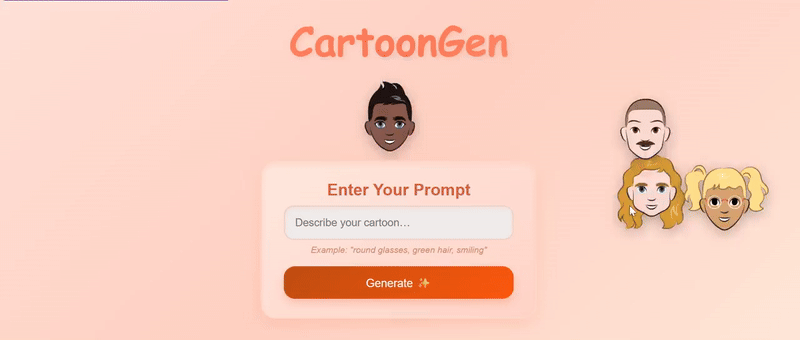
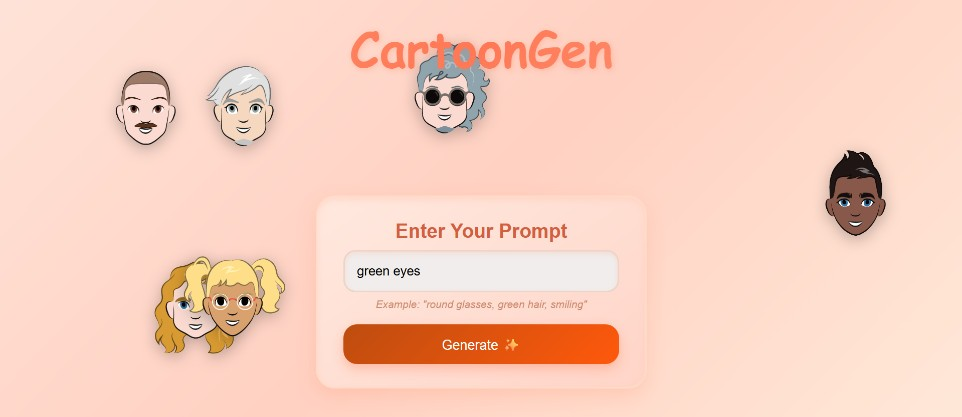
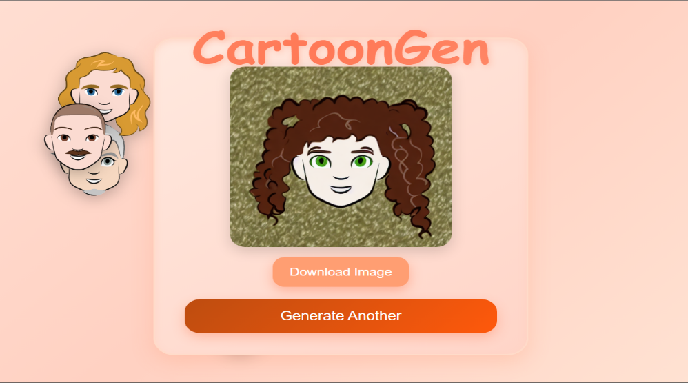

# CartoonGen – AI Cartoon Face Generator

CartoonGen is a fun and interactive web app that transforms real faces into cartoon versions using Generative AI. This project features an intuitive frontend and showcases AI-generated outputs.

### Prompt Input
This shows the prompt provided by the user to generate a cartoon image.

### Generated Output
This shows the cartoon image generated by the AI model.

## Model Training

The AI model behind CartoonGen generates cartoon faces from text prompts using **Stable Diffusion v1.5**, fine-tuned with **LoRA (Low-Rank Adaptation)**.  

We trained the model on a curated cartoon face dataset, using the **CLIP text encoder** to understand the prompts and a **UNet denoiser** to transform the latent representation into cartoon-style images. A **VAE** was used to encode and decode images during training and inference, helping the model capture the cartoon style effectively.  

